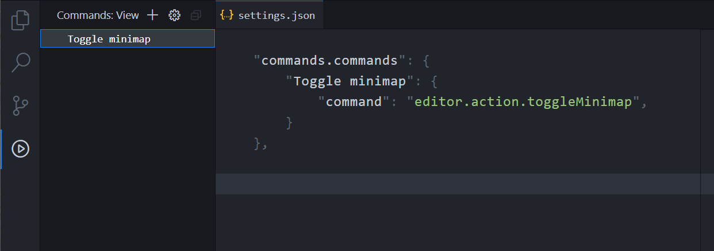
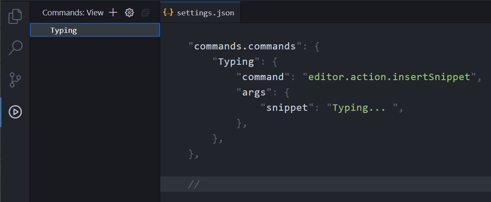
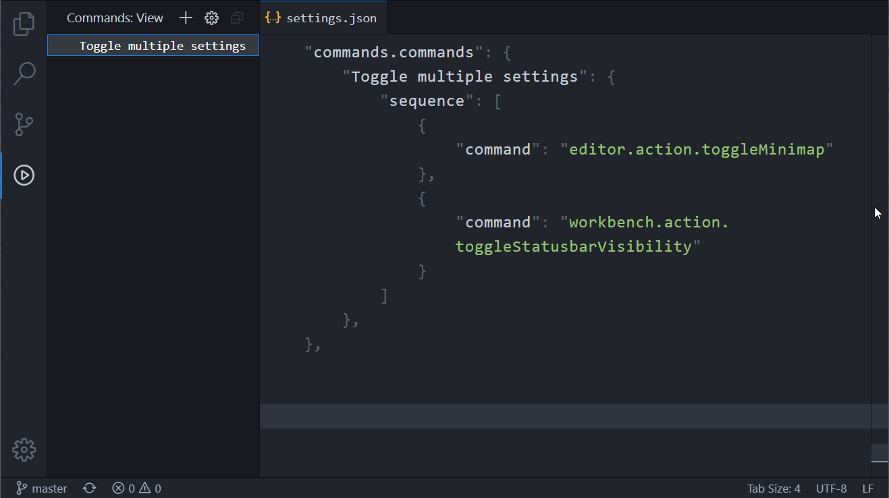
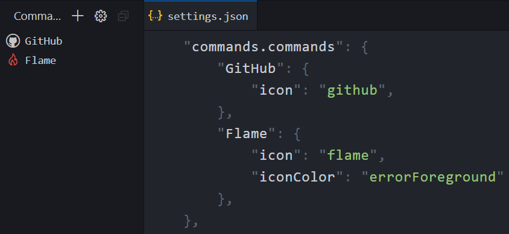
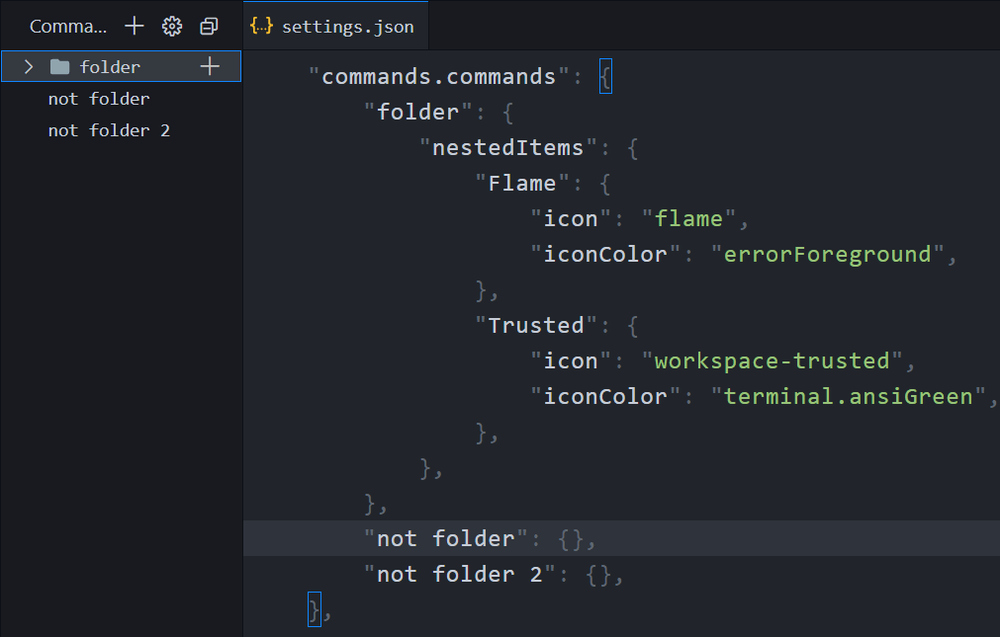
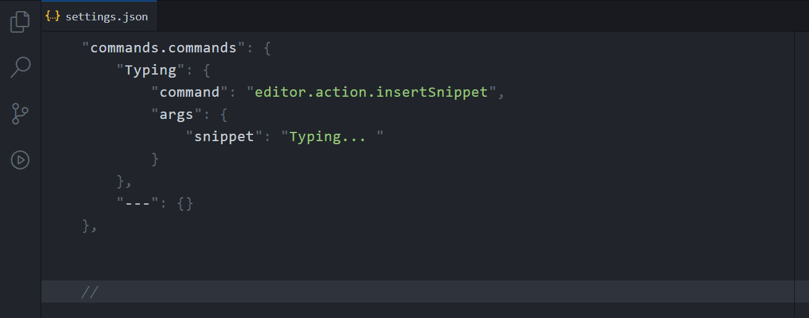
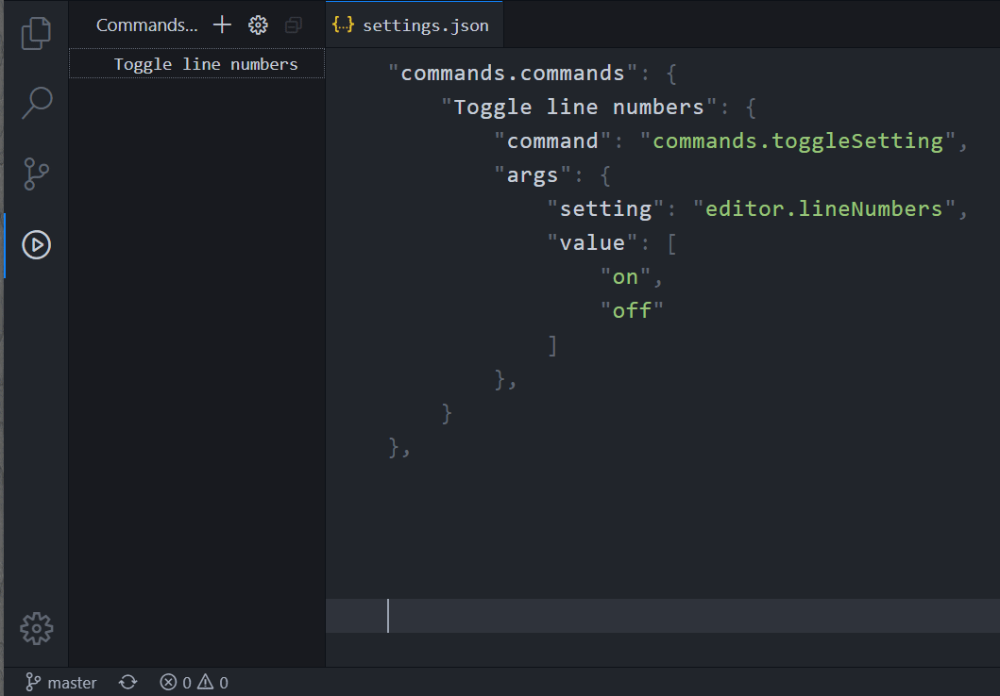

[](https://marketplace.visualstudio.com/items?itemName=usernamehw.commands)
[](https://marketplace.visualstudio.com/items?itemName=usernamehw.commands)
[](https://marketplace.visualstudio.com/items?itemName=usernamehw.commands)
[](https://open-vsx.org/extension/usernamehw/commands)

## Features

- Run commands with arguments ("args")
- Run multiple commands (in sequence)
- Use Tree View / Quick Pick / Status Bar / Document link to run commands
- Assign keyboard shortcut to specified commands
- Create alias for existing commands

## Simple command

```js
"Toggle activity": "workbench.action.toggleActivityBarVisibility",
```



## Command with arguments

```js
"Typing": {
    "command": "editor.action.insertSnippet",
    "args": {
        "snippet": "Typing... ",
    },
},
```



## Multiple commands (sequence)

```js
"Toggle multiple settings": {
    "sequence": [
        "editor.action.toggleMinimap",
        "workbench.action.toggleStatusbarVisibility",
    ],
},
```



## Tree View icons [list](https://code.visualstudio.com/api/references/icons-in-labels#icon-listing) | [colors](https://code.visualstudio.com/api/references/theme-color)

```js
"GitHub": {
    "icon": "github",
},
"Flame": {
    "icon": "flame",
    "iconColor": "errorForeground",
},
```



## Folders (nested items)

```js
"folder": {
    "nestedItems": {
        "Flame": {
            "icon": "flame",
            "iconColor": "errorForeground",
        },
        "Trusted": {
            "icon": "workspace-trusted",
            "iconColor": "terminal.ansiGreen",
        },
    },
},
```



## Quick Pick `commands.openAsQuickPick`



## Status Bar

```js
"Toggle line numbers": {
    "command": "commands.toggleSetting",
    "args": {
        "setting": "editor.lineNumbers",
        "value": [
            "on",
            "off",
        ],
    },
    "statusBar": {
        "alignment": "left",
        "text": "🔢",
        "priority": -9999,
    },
},
```




<!-- COMMANDS_START -->
## Commands (7)

|Command|Description|
|-|-|
|commands.openAsQuickPick|Commands: Open as Quick Pick|
|commands.selectAndRun|Commands: Select and run command|
|commands.rerun|Commands: Rerun last command|
|commands.suggestCommands|Commands: Suggest (autocomplete) commands|
|commands.suggestVariables|Commands: Suggest variables that are supported by this extension's variable substitutions, e.g: `${workspaceFolderBasename}`.|
|commands.newCommand|Commands: Add new command to the list|
|commands.escapeCommandUriArgument|Commands: Escape command uri argument|
<!-- COMMANDS_END -->

<!-- SETTINGS_START -->
## Settings (15)

|Setting|Default|Description|
|-|-|-|
|commands.commands|\{\}|Main extension property. Commands that will be rendered in the View.|
|commands.workspaceCommands|\{\}|Commands that will be rendered in the View, specific to the workspace.|
|commands.alias|\{\}|Use shorter command ids. Extension registers aliased commands so that they can be also used in keybindings.|
|commands.showKeybindings|**false**|Whether or not to show keyboard shortcuts assigned to command contributed by user. (Currently only displayed in Tree View).|
|commands.treeViewCollapseFolders|**false**|Collapse folders by default. Requires reload before being applied.|
|commands.treeViewStatusBarVisibleSymbol|"💠"|Symbol used in the tree view to indicate that command is also visible in the status bar.|
|commands.treeViewWorkspaceCommandSymbol|"🎯"|Symbol used in the tree view to indicate workspace command (from `#commands.workspaceCommands#`) setting.|
|commands.statusBarDefaultText|"same"|Controls the text of Status Bar item when adding from Tree View context menu.|
|commands.statusBarDefaultPosition|"left"|Where to put command on Status Bar (left or right).|
|commands.quickPickIncludeAllCommands|**false**|EXPERIMENTAL: When checked - include all commands from Command Palette to the Quick Pick.|
|commands.populateCommandPalette|**false**|Adds all items to Command Palette (Requires editor reload after every change of main config `#commands.commands#`).|
|commands.documentLinksEnabled|**false**|Run commands as links in documents. Links have format `@command?args@`.<br>[issues/2](https://github.com/usernamehw/vscode-commands/issues/2)|
|commands.documentLinksPattern|""|[Glob](https://code.visualstudio.com/api/references/vscode-api#GlobPattern) for `#commands.documentLinksEnabled#`. Example: `**/*.{ts,js}` - only enable in TypeScript & JavaScript files.|
|commands.variableSubstitutionEnabled|**false**|Allow `"args"` (of type string) to contain some of the variables from [variables-reference](https://code.visualstudio.com/docs/editor/variables-reference). Supported: <br>- `${file}` -  the current opened file absolute path <br>- `${fileBasename}` - the current opened file's basename <br>- `${fileBasenameNoExtension}` - the current opened file's basename with no file extension <br>- `${fileExtname}` - the current opened file's extension <br>- `${fileDirname}` - the current opened file's dirname <br>- `${fileWorkspaceFolder}` - the path of the folder opened in VS Code <br>- `${workspaceFolderBasename}` - the name of the folder opened in VS Code without any slashes (/) <br>- `${execPath}` - location of Code.exe <br>- `${pathSeparator}` - `/` on macOS or linux, `\` on Windows <br>- `${lineNumber}` - the current selected line number in the active file <br>- `${selectedText}` - the current selected text in the active file<br>- `${clipboard}` - current clipboard value<br>- `${random}` - 6 random Base-10 digits|
|commands.toggleSettings.showNotification|**false**|When enabled - show notification after using `commands.toggleSetting` or `commands.incrementSetting`.|
<!-- SETTINGS_END -->

```ts
// Command object structure
interface CommandObject {
    command: string;// command id to execute
    args?: unknown;// command arguments to execute
    delay?: number;// delay (ms) BEFORE execution
    repeat?: number;// run this command or sequence this number of times
    icon?: string;// icon id https://code.visualstudio.com/api/references/icons-in-labels#icon-listing
    iconColor?: string;// color id https://code.visualstudio.com/api/references/theme-color
    markdownTooltip?: string;// add custom markdown text to hover tooltip
    disableTooltip?: boolean;// do not show the hover tooltip for this Tree View Item
    hidden?: boolean;// Do not show this in Tree View

    sequence?: (CommandObject | string)[];// execute multipe commands

    nestedItems: {// Make into folder: Group items (1 lvl nesting max)
        [key: string]: CommandObject
    }

    // add command or folder to status bar
    statusBar?: {
        alignment: 'left' | 'right';// status bar alignment
        text: string;// status bar item text
        name?: string;// name of the item in status bar context menu
        priority?: number;// item position (can also be a negative number)
        tooltip?: string;// hover text
        markdownTooltip?: string;// hover text (in markdown)
        hidden?: boolean;// do not show this status bar item
        color?: string;// color of status bar item text
        backgroundColor?: 'error' | 'warning';// status bar item background color
        activeEditorGlob?: string// only show status bar item when active editor matches glob pattern
        activeEditorLanguage?: string;// only show status bar item when active editor language id matches
    };
}
```

## [Built-in commands (with args)](https://code.visualstudio.com/api/references/commands)

### `type` Type text into active editor

```js
"Typing": {
    "command": "type",
    "args": {
        "text": "---",
    },
},
```

### `workbench.action.tasks.runTask` Run [task](https://code.visualstudio.com/docs/editor/tasks) by its `label`

```js
// tasks.json
{
    "label": "hello",
    "type": "shell",
    "command": "echo Hello",
},
// commands
"Run task": {
    "command": "workbench.action.tasks.runTask",
    "args": "hello",
},
```

### `editor.action.insertSnippet` Insert [Snippet](https://code.visualstudio.com/docs/editor/userdefinedsnippets)

```js
"Insert snippet": {
    "command": "editor.action.insertSnippet",
    "args": {
        "snippet": "$BLOCK_COMMENT_START ${0:?} $BLOCK_COMMENT_END",
    },
},
```

### `workbench.action.terminal.sendSequence` Send text to active terminal

```js
"Terminal: Run Watch": {
    "command": "workbench.action.terminal.sendSequence",
    "args": {
        "text": "npm run watch\r",
    },
},
```

### `workbench.action.quickOpen` Quick access

Can open Quick Pick with prefilled prefix (`@...` - symbol, `view ...` - open view, ...)

```js
"Quick open (symbol)": {
    "command": "workbench.action.quickOpen",
    "args": "?",
},
```

### `workbench.action.openSettings` Open settings with prefilled input value

```js
"Open Settings": {
    "command": "workbench.action.openSettings",
    "args": "commands",
},
```

### `workbench.action.openGlobalKeybindings` Open keybindings with prefilled value

```js
"Quick Keybindings Editor": {
    "command": "workbench.action.openGlobalKeybindings",
    "args": "commands.",
},
```

### `workbench.extensions.search` Open Extensions View with prefilled value

```js
"Quick Extensions View": {
    "command": "workbench.extensions.search",
    "args": "@builtin",
},
```

### `editor.action.codeAction` Execute [code action](https://code.visualstudio.com/docs/editor/refactoring#_keybindings-for-code-actions)

```js
"Organize imports": {
    "command": "editor.action.codeAction",
    "args": {
        "kind": "source.organizeImports",
    },
},
```

### `workbench.action.findInFiles` Open search with specified args

```js
"Search with args": {
    "command": "workbench.action.findInFiles",
    "args": {
        "query": "TODO",
        "isRegex": false,
        "isCaseSensitive": false,
        "matchWholeWord": false,
        "preserveCase": false,
        "excludeSettingAndIgnoreFiles": true,
        "triggerSearch": true,
        "onlyOpenEditors": false,
        // "replace": "",
        // "filesToInclude": "",
        // "filesToExclude": "",
    },
},
```

### `editor.actions.findWithArgs` Open Editor Find Widget

```js
"Find Widget with args": {
    "command": "editor.actions.findWithArgs",
    "args": {
        "searchString": "TODO",
        "replaceString": "",
        "isRegex": false,
        "isCaseSensitive": false,
        "matchWholeWord": false,
        "preserveCase": false,
        "findInSelection": false,
    },
},
```

### `search.action.openNewEditor` Open [Search Editor](https://code.visualstudio.com/updates/v1_43#_search-editors) with specified args

```js
"Open search editor with args": {
    "command": "search.action.openNewEditor",
    "args": {
        "query": "TODO",
        "isRegexp": false,
        "isCaseSensitive": false,
        "matchWholeWord": false,
        "preserveCase": false,
        "excludeSettingAndIgnoreFiles": true,
        "triggerSearch": true,
        "contextLines": 2,
        "showIncludesExcludes": true,
        // "filesToInclude": "",
        // "filesToExclude": "",
    },
},
```

### `cursorMove` Move cursor to a logical position in the view

Arguments object:

- **to** A mandatory logical position value providing where to move the cursor.
> 'left', 'right', 'up', 'down', 'prevBlankLine', 'nextBlankLine',
> 'wrappedLineStart', 'wrappedLineEnd', 'wrappedLineColumnCenter'
> 'wrappedLineFirstNonWhitespaceCharacter', 'wrappedLineLastNonWhitespaceCharacter'
> 'viewPortTop', 'viewPortCenter', 'viewPortBottom', 'viewPortIfOutside'
- **by** Unit to move. Default is computed based on 'to' value.
> 'line', 'wrappedLine', 'character', 'halfLine'
- **value** Number of units to move. Default is '1'.
- **select** If 'true' makes the selection. Default is 'false'.

```js
"Cursor move 10 down": {
    "command": "cursorMove",
    "args": {
        "to": "down",
        "by": "line",
        "value": 10,
    },
},
```

### `editorScroll` Scroll editor in the given direction

Arguments object:

- **to** A mandatory direction value (`up` or `down`).
- **by** Unit to move. Default is computed based on 'to' value. (`line`, `wrappedLine`, `page`, `halfPage`).
- **value**: Number of units to move. Default is 1.
- **revealCursor**: If 'true' reveals the cursor when it is outside view port.

```js
"Scroll 10 lines down": {
    "command": "editorScroll",
    "args": {
        "to": "down",
        "by": "line",
        "value": 10,
        "revealCursor": true,
    },
},
```


### `moveActiveEditor` Move the active editor by tabs or groups

- **to** String value providing where to move (`left` or `right`).
- **by** String value providing the unit for move (by `tab` or by `group`).
- **value** Number value providing how many positions or an absolute position to move.

```js
"Move editor to the left": {
    "command": "moveActiveEditor",
    "args": {
        "to": "left",
        "by": "tab",
        "value": 50,
    },
},
```

### `vscode.setEditorLayout` Sets the editor layout

Example for a 2x2 grid:

```js
"2x2 grid": {
    "command": "vscode.setEditorLayout",
    "args": { "orientation": 0, "groups": [{ "groups": [{}, {}], "size": 0.5 }, { "groups": [{}, {}], "size": 0.5 }] },
},
```

### `editor.emmet.action.wrapWithAbbreviation` Wrap text with emmet

```js
"Wrap in div": {
    "command": "editor.emmet.action.wrapWithAbbreviation",
    "args": {
        "abbreviation": "div",
        "language": "html",
    },
},
```

### `vscode.openIssueReporter` Opens the issue reporter with the provided extension id as the selected source

- **extensionId** - extensionId to report an issue on

```js
"Issue: preselect extension": {
    "command": "vscode.openIssueReporter",
    "args": "usernamehw.commands",
},
```

### `workbench.extensions.installExtension` Install extension by id

```js
"Install extension": {
    "command": "workbench.extensions.installExtension",
    "args": "usernamehw.errorlens",
},
```

### `workbench.extensions.uninstallExtension` Uninstall extension by id

```js
"Uninstall extension": {
    "command": "workbench.extensions.uninstallExtension",
    "args": "usernamehw.errorlens",
},
```

### `workbench.extensions.action.showExtensionsWithIds` Show extensions in Extensions View by id

```js
"Show specific extensions": {
    "command": "workbench.extensions.action.showExtensionsWithIds",
    "args": [
        "usernamehw.commands",
        "usernamehw.errorlens",
    ],
},
```

## Additional commands

### `commands.toggleSetting` Toggle settings

```js
"Toggle boolean setting (pass string args)": {
    "command": "commands.toggleSetting",
    "args": "editor.renderIndentGuides",
},
```

```js
"Pass array of values to cycle through": {
    "command": "commands.toggleSetting",
    "args": {
        "setting": "workbench.colorTheme",
        "value": ["Monokai", "Kimbie Dark"],
    },
    "icon": "symbol-color",
},
```

```js
"Toggle workspace setting": {
	"command": "commands.toggleSetting",
	"args": {
		"setting": "workbench.editor.showTabs",
		"target": "workspace",
	},
},
```

```js
"Set/reset setting": {
    "command": "commands.toggleSetting",
    "args": {
        "setting": "window.zoomLevel",
        "value": [0],
    },
},
```

### `commands.incrementSetting` Increment/decrement setting

```js
"Font size ++": {
    "command": "commands.incrementSetting",
    "args": {
        "setting": "editor.fontSize",
        "value": 0.5,
        // "target": "workspace",
    },
},
```

```js
"Font size --": {
    "command": "commands.incrementSetting",
    "args": {
        "setting": "editor.fontSize",
        "value": -0.5,
    },
},
```

### `commands.toggleTheme` Toggle themes by groups (depending on active theme kind)

```js
"Toggle Themes": {
    "command": "commands.toggleTheme",
    "args": {
        "dark": "Default Dark+,GitHub Dark",
        "light": "Default Light+,GitHub Light",
    },
},
```

### `commands.openFolder` Open file/folder in vscode

```js
"Open file": {
    "command": "commands.openFolder",
    "args": "C:\\temp\\temp.txt",
},
"Open relative file": {
    "command": "commands.openFolder",
    "args": "./package.json",// open relative to the first opened workspace folder
},
"Open folder": {
    "command": "commands.openFolder",
    "args": "C:\\temp",
},
```

### `commands.focusTerminal` Focus specific terminal

```js
"Focus newest non-task terminal": {
    "command": "commands.focusTerminal",
},
"Focus terminal named 'foobar' (string argument)": {
    "command": "commands.focusTerminal",
    "args": "foobar"
},
"Focus terminal named 'foobar'": {
    "command": "commands.focusTerminal",
    "args": {
        "target": "newest",// focus newest matching terminal; create new if no match
        "name": "foobar",// if no match, assign a name to the new terminal
        "icon": "zap",// if no match, assign a Codicon to the new terminal
        "iconColor": "terminal.ansiCyan",// if no match, assign a color (from current theme) to the new terminal
        // "cwd": "",
    },
},
```

### `commands.runInTerminal` Send text to new (or specified) terminal

```js
"Terminal => watch (string argument)": {
    "command": "commands.runInTerminal",
    "args": "npm run watch"
},
"Terminal => watch": {
    "command": "commands.runInTerminal",
    "args": {
        "text": "npm run watch",
        "name": "watch",
        "reveal": true,
        "waitForExit": false,// will wait for terminal to exit before running next command
        "reuse": "newest",// reuse newest same-named terminal; create new if no match
        "icon": "zap",// if no match, assign a Codicon to the new terminal
        "iconColor": "terminal.ansiCyan",// if no match, assign a color (from current theme) to the new terminal
        // "cwd": "",
    },
},
```

### `commands.startDebugging` Start debugging by "name" property from **launch.json**

```js
"Debug extension": {
    "command": "commands.startDebugging",
    "args": "Extension",
},
```

### `commands.setEditorLanguage` Change active editor [language id](https://code.visualstudio.com/docs/languages/identifiers#_known-language-identifiers)

```js
"Set Language JavaScript": {
    "command": "commands.setEditorLanguage",
    "args": "javascript",
},
```

### `commands.clipboardWrite` Write text to clipboard

```js
"Populate clipboard": {
    "command": "commands.clipboardWrite",
    "args": "||||||||",
},
```

### `commands.showNotification` Show VSCode notification

```js
"Msg": {
    "command": "commands.showNotification",
    "args": "info msg",
},
"Msg error": {
    "command": "commands.showNotification",
    "args": {
        "severity": "error",// "warning" | "info"
        "message": "bad",
    },
},
```

### `commands.showStatusBarNotification` Show notification in status bar

```js
"Notification in status bar": {
    "command": "commands.showStatusBarNotification",
    "args": {
        "message": "Read me fast",
        "color": "#f00",
        "timeout": 5000,
    },
},
```

### `commands.openExternal` Open link in default browser

```js
"Open google.com": {
    "command": "commands.openExternal",
    "args": "https://www.google.com",
},
"Open Extension Preview": {
    "command": "commands.openExternal",
    "args": "vscode:extension/usernamehw.commands",
},
```

### `commands.open` Open file in default app (Uses [open](https://github.com/sindresorhus/open#readme))

```js
"Open in default app": {
    "command": "commands.open",
    "args": "C:\\temp\\img.png",
},
"Open in specified app": {
    "command": "commands.open",
    "args": {
        "target": "C:\\temp\\img.png",
        "app": "firefox",// Or absolute path
        "arguments": ["-devtools"],
    },
},
```

### `commands.revealFileInOS` Open system file explorer and reveal the specified path

```js
"commands.revealFileInOS": {
    "command": "commands.revealFileInOS",
    "args": "C:/Users",
},
```

---

## Running sequence without adding it to `settings.json`

If the only purpose for a command sequence is to run it from a keybinding, then it might be easier to just run it from a `keybindings.json` file directly:

```js
{
    "key": "ctrl+shift+9",
    "command": "commands.run",
    "args": [
        "editor.action.toggleMinimap",
        "workbench.action.toggleSidebarVisibility",
    ],
},
```

## Codicons

To quickly find an icon (for Tree View or Status Bar) there's an extension that can show all codicons (with preview) and insert picked id into the editor:

[Codicon Names](https://marketplace.visualstudio.com/items?itemName=usernamehw.codicon-names)


There's also a [vscode-codicons](https://microsoft.github.io/vscode-codicons/dist/codicon.html) web page to browse codicons.

## Using your own color for tree view icon

```js
"workbench.colorCustomizations": {
    "mycolor": "#ffc01f",
},
"commands.commands": {
    "Command": {
        "icon": "dashboard",
        "iconColor": "mycolor",
    },
},
```

## [More examples](https://github.com/usernamehw/vscode-commands/tree/master/docs/examples.md)

## Upstream issues

Please upvote the following VS Code issues:

- [Provide some richer (optional) UI for custom tree views](https://github.com/microsoft/vscode/issues/97190)
- [Allow TreeItem.label to support MarkdownString](https://github.com/microsoft/vscode/issues/115365)

<!--

Open files by glob? vscode.workspace.findFiles
go to symbol in file

workbench.action.terminal.newWithCwd
`editor.action.refactor` & `editor.action.sourceAction` - both covered by `editor.action.codeAction`
workbench.action.files.newUntitledFile (arg `viewType` eg `vscode.markdown.preview.editor`)
vscode.diff
vscode.openWith `commands.executeCommand("vscode.openWith", uri, MyCustomEditor.viewType);`
editor.unfold
editor.fold

TODO: https://github.com/microsoft/vscode-docs/blob/main/api/references/commands.md Sync changes periodically
-->